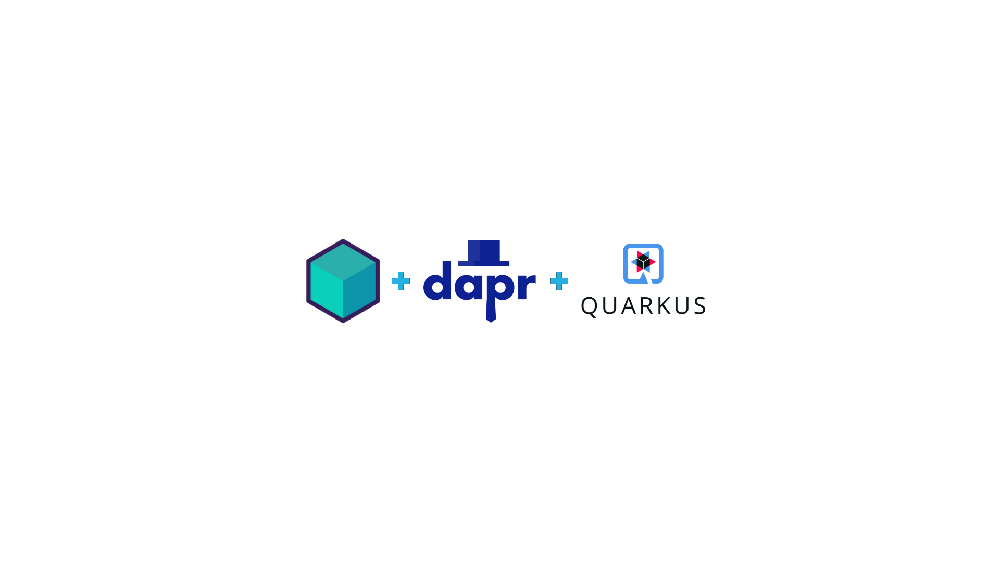
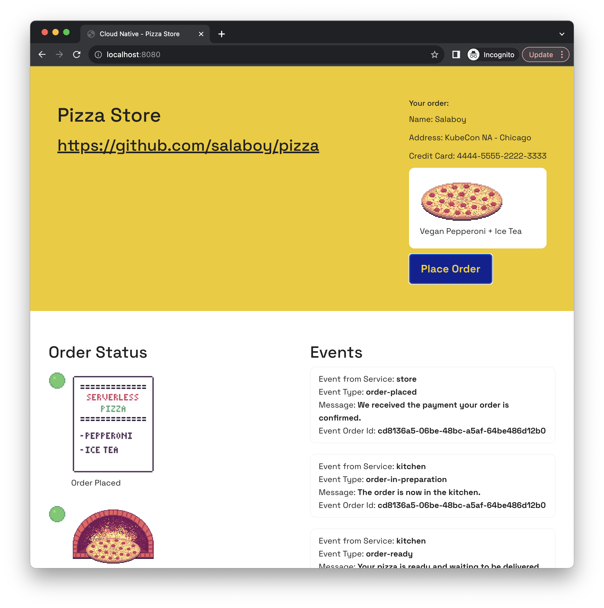
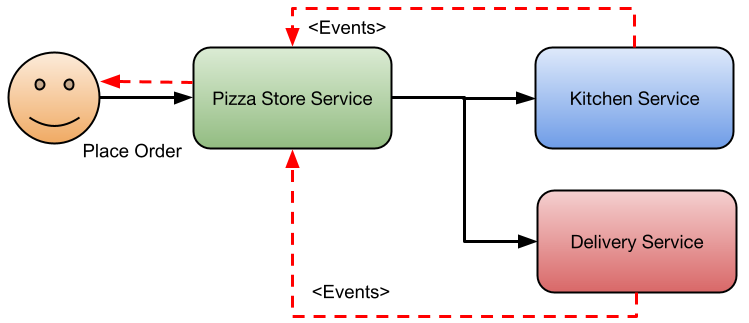
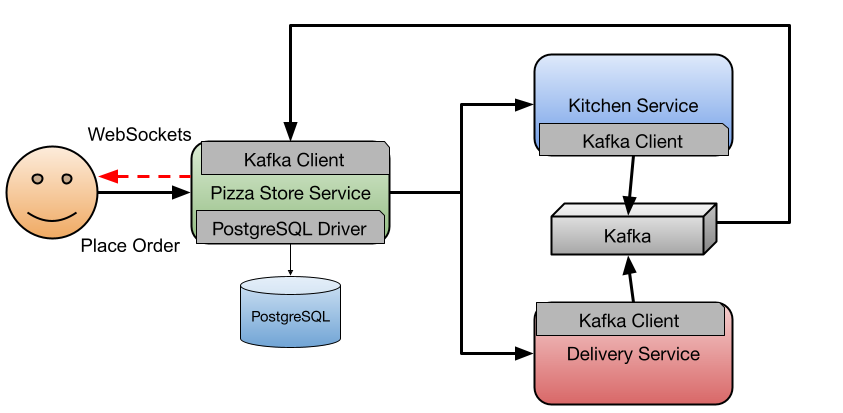
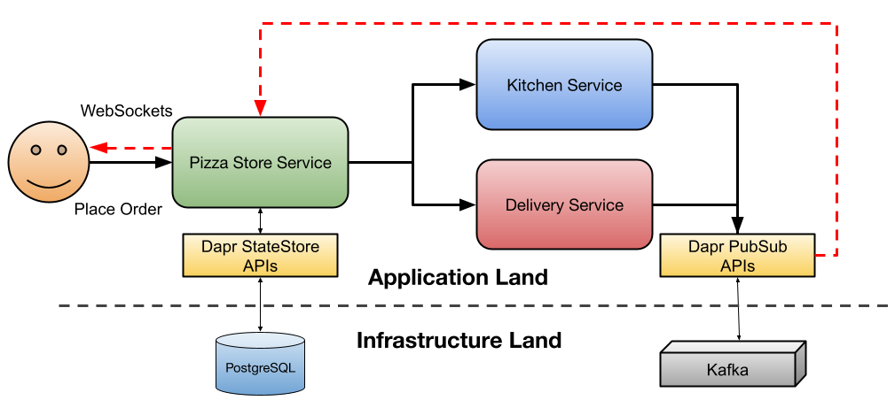

# Cloud-Native Pizza Delivery system

This repository contains a simple example for a Pizza Store application using Kubernetes, [Dapr](https://dapr.io) and [Testcontainers](https://testcontainers.com) with [Quarkus](https://pt.quarkus.io/) to enable developers with an awesome developer experience.

> This repository is a copy of the https://github.com/salaboy/pizza repository, rewritten using Quarkus.



You can run this application on any Kubernetes cluster by following the step-by-step instructions described in this document. 



The Pizza Store application simulates placing a Pizza Order that is going to be processed by different services. The application is composed by the Pizza Store Service which serve as the front end and backend to place the order. The order is sent to the Kitchen Service for preparation and once the order is ready to be delivered the Delivery Service takes the order to your door.



As any other application, these services will need to store and read data from a persistent store such as a Database and exchange messages if a more event-driven approach is needed.

This application uses PostgreSQL and Kafka, as they are well-known components among developers.



As you can see in the diagram, if we want to connect to PostgreSQL from the Pizza Store Service we need to add to our applications the PostgreSQL driver that must match with the PostgreSQL instance version that we have available. A Kafka client is required in all the services that are interested in publishing or consuming messages/events. Because you have Drivers and Clients that are sensitive to the available versions on the infrastructure components, the lifecycle of the application is now bound to the lifecycle of these components.

Adding Dapr to the picture not only breaks these dependencies, but also remove responsabilities from developers of choosing the right Driver/Client and how these need to be configured for the application to work correctly. Dapr provides developers building block APIs such as the StateStore and PubSub API that developer can use without know the details of which infrastructure is going to be connected under the covers.




## Installation

If you don't have a Kubernetes Cluster, you can [install KinD](https://kind.sigs.k8s.io/docs/user/quick-start/) to create a local cluster to run the application. 

Once you have KinD installed, you can run the following command to create a local Cluster: 

```
kind create cluster
```

Then we will install [Dapr](https://dapr.io) into our fresh new cluster by running the following command: 

```
helm repo add dapr https://dapr.github.io/helm-charts/
helm repo update
helm upgrade --install dapr dapr/dapr \
--version=1.12.0 \
--namespace dapr-system \
--create-namespace \
--wait
```

## Installing infrastructure for the application

We will be using Kafka for sending messages between services: 

```
helm install kafka oci://registry-1.docker.io/bitnamicharts/kafka --version 22.1.5 --set "provisioning.topics[0].name=events-topic" --set "provisioning.topics[0].partitions=1" --set "persistence.size=1Gi" 
```

We will be using PostgreSQL as our persistent store, but before installing the PostgreSQL Chart run:

```
kubectl apply -f k8s/pizza-init-sql-cm.yaml
```

Then: 

```
helm install postgresql oci://registry-1.docker.io/bitnamicharts/postgresql --version 12.5.7 --set "image.debug=true" --set "primary.initdb.user=postgres" --set "primary.initdb.password=postgres" --set "primary.initdb.scriptsConfigMap=pizza-init-sql" --set "global.postgresql.auth.postgresPassword=postgres" --set "primary.persistence.size=1Gi"

```

## Installing the Application

To install the application you only need to run the following command: 

```
kubectl apply -f k8s/
```

This install all the application services. To avoid dealing with Ingresses you can access the application by using `kubectl port-forward`, run to access the application on port `8080`: 

```
kubectl port-forward svc/pizza-store 8080:80
```

Then you can point your browser to [`http://localhost:8080`](http://localhost:8080) and you should see: 


## Building from source / changing the services

The application services are written using Java + Quarkus. These services use the Dapr Extension to interact with the Dapr [PubSub](https://docs.dapr.io/getting-started/quickstarts/pubsub-quickstart/) and [Statestore](https://docs.dapr.io/getting-started/quickstarts/statemanagement-quickstart/) APIs. 

To run the services locally you can use the [Testcontainer](https://testcontainaers.com) integration already included in the projects. 

For example you can start a local version of the `pizza-store` service by running the following command inside the `pizza-store/` directory (this requires having Java and [Maven](https://maven.apache.org/) installed locally):

```
quarkus dev
```

This, not only start the `pizza-store` service, but it also uses the [Testcontainers + Dev Services for Dapr](https://github.com/quarkiverse/quarkus-dapr) integration to configure and wire up a Dapr configuration for local development. In other words, you can now use Dapr outside of Kubernetes, for writing your service tests without the need to know how Dapr is configured. 


Once the service is up, you can place orders and simulate other events coming from the Kitchen and Delivery services by sending HTTP requests to the `/events` endpoint. 

Using [`httpie`](https://httpie.io/) this look like this: 

```
http :8080/events Content-Type:application/cloudevents+json < pizza-store/event-in-prep.json
```

In the Application you should see the event recieved that the order moving forward. 


# Resources and references

- [Platform engineering on Kubernetes Book](http://mng.bz/jjKP?ref=salaboy.com)
- [Testcontainers for Go Developers](https://www.atomicjar.com/2023/08/local-development-of-go-applications-with-testcontainers/)
- [Cloud native local development with Dapr and Testcontainers](https://www.diagrid.io/blog/cloud-native-local-development)

# Feedback / Comments / Contribute

Feel free to create issues or get in touch with us using Issues or via [Twitter @Salaboy](https://twitter.com/salaboy)
